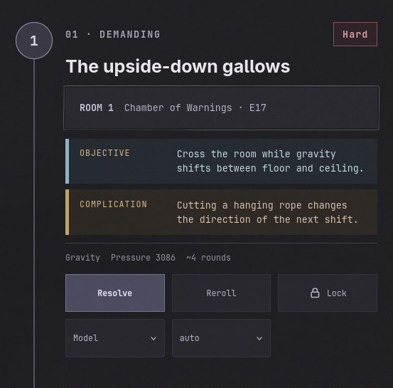

# small changes
i want to change the non combat encounters a little for example if you have   thenon easy - hard it should display the saves needed to pass the encounter and the rewards for passing it. etc.

the encounter does not always have to be in the top range of the difficylty the party can handle.

i want wizards resources to count more. also i want for the hp to matter less and the resources to matter more. i want the player to be able to use their resources to get out of encounters and not just rely on hp.
(i was thinking how bigger the resource dependency the lesser hp should count for the player so for example rogue has no dependecy on resources so hp should be almost 100% count as the players readiness to face encounters but for wizards they have a high dependency on resources so hp should count for less and resources should count for more. example wizard 30%hp 70% resources, rogue 90% hp 10% resources, fighter 80% hp 20% resources, etc.in the end the party should be at 100% at full health and full resources to be at 100% readiness to face encounters.)

so i want to change something about encounter creation/model
before i came in i had shortrested wich made my hp go back up it created when i decended the floor
combat hard near deadly- social hard, hazard, medium. 
i locked the battle for the fight and as the party took damge and used resources the 2 non combat encounters changed to combat encounter that where easier because of the fight but i would like the encounters to stay the same type upon first generation of decending the floor if possible. (only to be altered if the dm selects to change them.) 

# big changes
i want the code to be beter documented like how proffesionals would do it. further i want all the values that would be needed to tweak the difficulty and algorithms and player proficiencie presets in one file so it can be easily tweaked and changed.

i dont like the piss yellow scheme i want a more neutral color scheme that is easier on the eyes. something like the new dwarf forest. 

i want better visual hierarchy and better visual cues for the user to know what is going on. i want the user to be able to see what is going on and what is happening with the monsters and players. 

the me