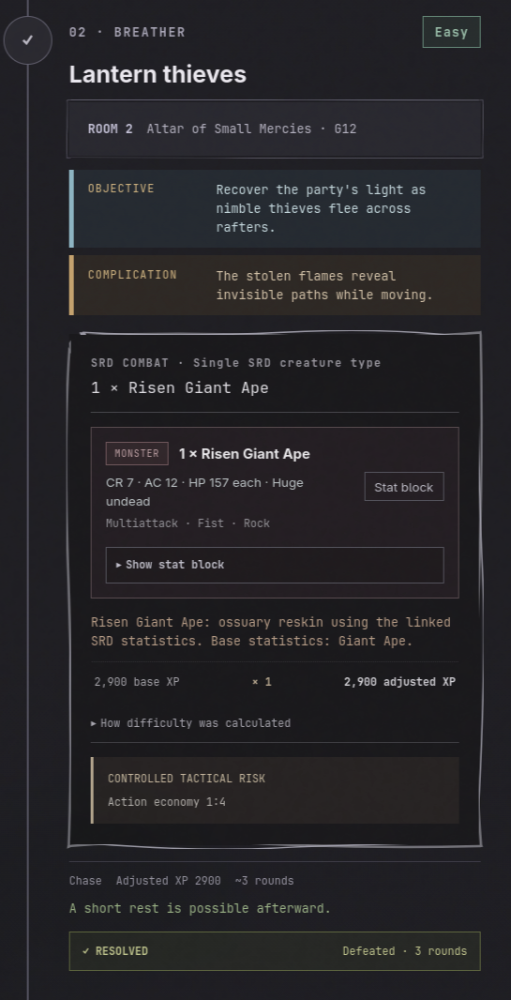
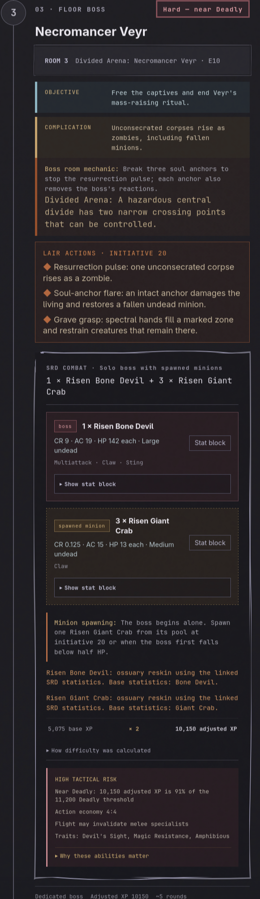

# small changes
i want to change the non combat encounters a little for example if you have   thenon easy - hard it should display the saves needed to pass the encounter and the rewards for passing it. etc.

the encounter does not always have to be in the top range of the difficylty the party can handle.

i want wizards resources to count more. also i want for the hp to matter less and the resources to matter more. i want the player to be able to use their resources to get out of encounters and not just rely on hp.
(i was thinking how bigger the resource dependency the lesser hp should count for the player so for example rogue has no dependecy on resources so hp should be almost 100% count as the players readiness to face encounters but for wizards they have a high dependency on resources so hp should count for less and resources should count for more. example wizard 30%hp 70% resources, rogue 90% hp 10% resources, fighter 80% hp 20% resources, etc.in the end the party should be at 100% at full health and full resources to be at 100% readiness to face encounters.)

so i want to change something about encounter creation/model
before i came in i had shortrested wich made my hp go back up it created when i decended the floor
combat hard near deadly- social hard, hazard, medium. 
i locked the battle for the fight and as the party took damge and used resources the 2 non combat encounters changed to combat encounter that where easier because of the fight but i would like the encounters to stay the same type upon first generation of decending the floor if possible. (only to be altered if the dm selects to change them.) 

i want to be able to scoll on the right or left colm to make sure i can have what i want on my screen.

add a lock the next encounter for combat btn.

maybe i want to add a button that goes into complete mode and you can select the rooms/hallways that are completed and then it visualy changes on the map.

one thing i was thinkin about.  says that you can rest after room 2 but. you would have to backtrac to the safe room to rest would it be smart maybe to do a*pathfinding to determene if the party can get back to the safe room and if they can then they can rest. if not then they cant rest. etc etc if 

if it is as expeected dont increase the difficulty. 

what do shrines do?

the excalidraw draw stile above the cards so it dos not apeear behind the cards.

 with all these lair/boss/floor mechanics how can we make sure that the difficulty is actualy what the party can handle even if the encounter is at deadly.

when i click on resolve encounter and want to exit it, to go back it resolves the encounter what i dont want.

locked doors(show the dc needed higher if party level is higher).
# big changes
i want the code to be beter documented like how proffesionals would do it. further i want all the values that would be needed to tweak the difficulty and algorithms and player proficiencie presets in one file so it can be easily tweaked and changed.

